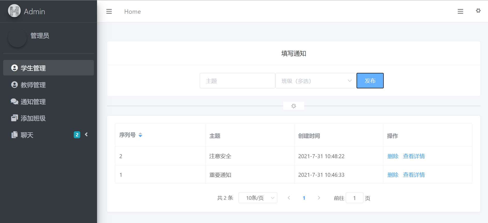
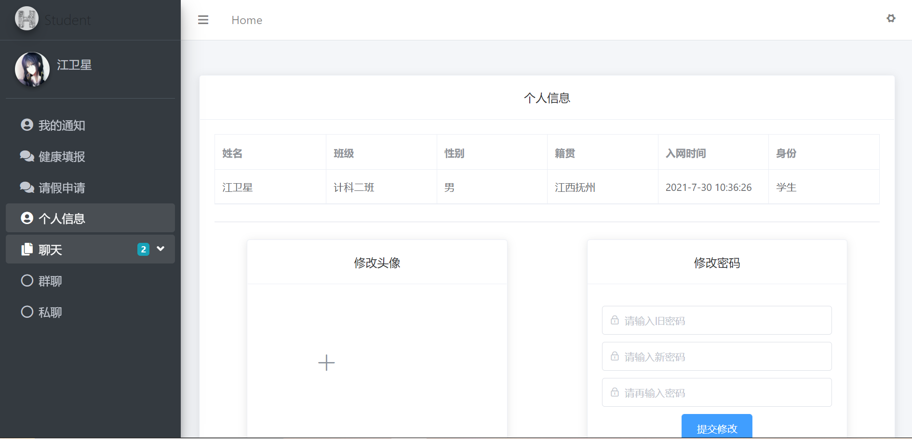
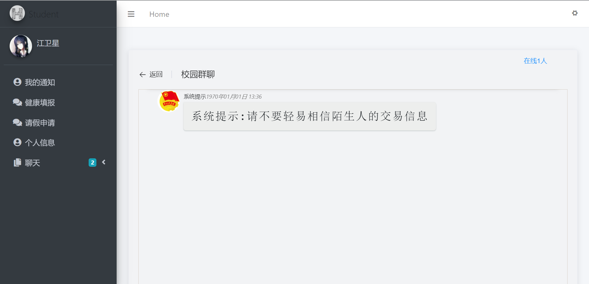

# 校园疫情防控管理系统

#### 介绍
>
>这个项目由本人全部纯手敲设计,包括接口文档,思维导图等.................

#### 技术栈
>1.使用vue+element-ui框架进行前端开发
>
>2.使用nodejs+express+mysql+socket进行后台开发
>
>3.前后端分离开发
>
>4.其中使用到的一些可以但没必要的技术(如:Redis),纯属本人练手而使用
>
>基于 Vue2.0 和 echarts 封装的 v-charts 图表组件,可轻松生成常见的图表。

#### 使用说明
>1. 本项目使用了`Redis`,主要就是为了练习这一知识点,所以需要先打开Redis数据库(该免安装文件包传在tools中,直接点击运行即可),当然你要是不想,可以自己改一下源码把解析文件那备份重写即可 :ok_hand: 还有`记得先创建mysql数据库与表结构!!创表语句我在接口文档中给出了`
>2. 下载项目第一步`yarn`或者`npm i`所有依赖,其次你需要有安装node环境(很简单,去官网下载一个exe安装即可)
>3. 运行node端代码:`npm run start`  or `yarn start`
>4. 运行前端部分项目:`npm run serve` or `yarn serve`  或者`npm run build`

#### 大致实现效果图(部分功能展示)
1. 思维导图

2.部分首页

3.登陆界面

4.管理员页面

5.解析Excel文件导入用户信息

6.发布通知

7.查看通知详情

8.教师请假审批

9.学生请假申请

10.学生获取个人通知

11.通用部分_修改本账户信息

12.全校群聊 
